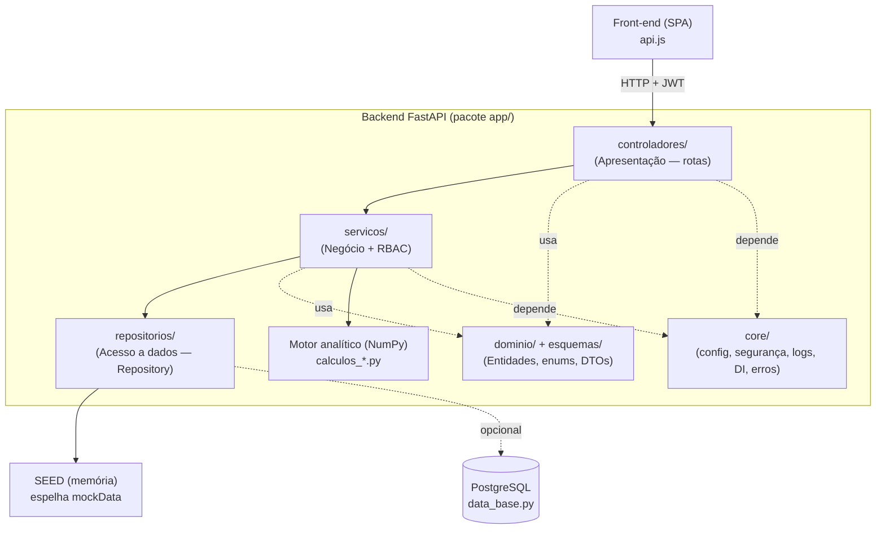
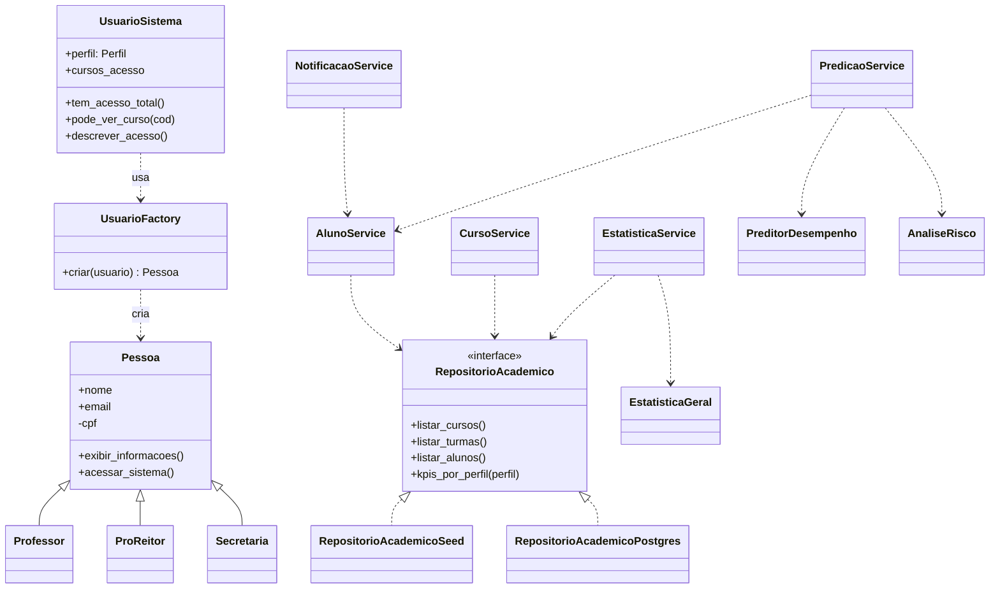
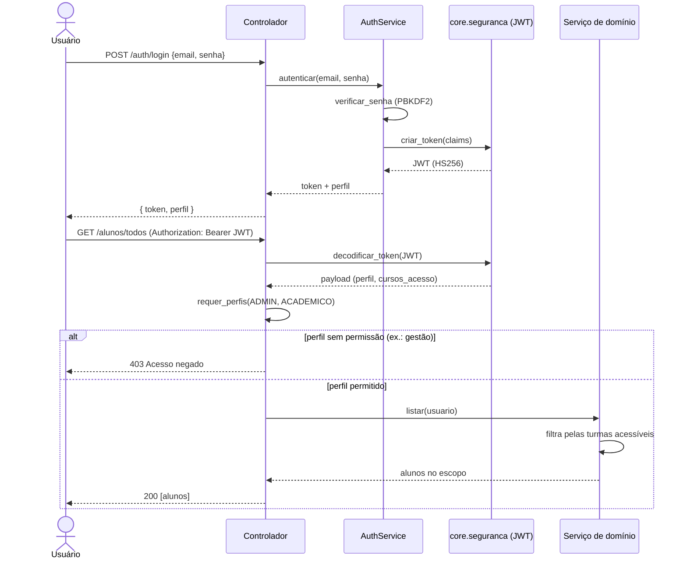

# 🏗️ Arquitetura do Backend — Predicta (SIMPA)

Documentação técnica do back-end construído para o front-end existente, **sem
alterar nenhum arquivo do front**. A API foi desenhada para cumprir exatamente o
contrato documentado em `frontend_dashboard/js/api.js` e devolver objetos no
mesmo formato de `frontend_dashboard/js/mockData.js`.

> Stack: **Python + FastAPI + Pydantic + NumPy**. Autenticação (JWT) e hash de
> senha usam apenas a biblioteca padrão (sem dependências externas).

---

## ▶️ Como executar

```bash
# 1. Instalar dependências
pip install -r requirements.txt

# 2. Subir a API (igual de sempre)
python main.py
#   ou: uvicorn main:app --reload
```

| Recurso | URL |
|---|---|
| Documentação interativa (Swagger) | http://localhost:8000/docs |
| Painel (front-end) | http://localhost:8000/painel/ |
| Status da API | http://localhost:8000/ |

**Usuários de demonstração** (senha `predicta123`):

| E-mail | Perfil | Acesso |
|---|---|---|
| `admin@unievangelica.edu.br` | `admin` | Vê tudo |
| `reitoria@unievangelica.edu.br` | `gestao` | Cursos e turmas (macro) |
| `prof@unievangelica.edu.br` | `academico` | Apenas seus cursos e alunos |

**Testes:** `python testes_api.py` (24 testes de integração, sem servidor/banco).

Por padrão a API usa o repositório **SEED** (em memória, espelha o mock do
front). Para ligar o PostgreSQL: `PREDICTA_USAR_POSTGRES=true`.

---

## 🧱 Arquitetura em camadas

O código segue **separação de camadas** (modelo → repositório → serviço →
controlador), com a infraestrutura transversal isolada em `core/`.



Responsabilidade de cada camada:

| Camada | Pasta | Responsabilidade |
|---|---|---|
| Apresentação | `app/controladores/` | Define os endpoints, valida entrada/saída (Pydantic) e aplica RBAC via `Depends`. Não contém regra de negócio. |
| Negócio | `app/servicos/` | Regras, controle de acesso por perfil e orquestração entre repositório e motor analítico. |
| Dados | `app/repositorios/` | Acesso aos dados atrás de uma **interface** (`RepositorioAcademico`). Troca Seed ↔ PostgreSQL sem afetar o resto. |
| Domínio | `app/dominio/`, `app/esquemas/` | Enums (`Perfil`, `NivelRisco`), modelo do usuário, fábrica de papéis e DTOs. |
| Infra | `app/core/` | Configuração (Singleton), JWT + hash, logging/monitoramento, injeção de dependências e tratadores de erro. |
| Analítica | `calculos_*.py` (raiz) | Motor de estatística/predição em NumPy — **reaproveitado**, não reescrito. |

---

## 🎯 Padrões de projeto aplicados

| Padrão | Onde | Para quê |
|---|---|---|
| **Application Factory** | `app/factory.py` | Monta a app de forma testável e desacoplada do `main.py`. |
| **Repository** | `app/repositorios/` | Abstrai a origem dos dados (Seed/Postgres) atrás de `RepositorioAcademico`. |
| **Factory Method** | `app/repositorios/academico_repo.py`, `app/dominio/usuarios.py` | `obter_repositorio_academico()` escolhe a fonte; `UsuarioFactory` instancia a subclasse de `Pessoa` por perfil. |
| **Singleton** | `app/core/config.py`, `dependencias.py` (`lru_cache`) | Uma única configuração e uma única instância de cada serviço/repositório. |
| **Dependency Injection** | `app/core/dependencias.py` | Serviços e usuário autenticado injetados nos controladores via `Depends`. |
| **DTO** | `app/esquemas/` | Contratos de entrada/saída separados das entidades de domínio. |
| **Strategy (heurística)** | `app/servicos/notificacao_service.py` | Escolha do template de mensagem conforme o motivo de risco do aluno. |

---

## 🧩 Diagrama de classes (UML)



---

## 🔐 Sequência — Login e requisição autenticada (RBAC)



---

## 📚 Referência da API

> Todas as rotas (exceto `/auth/login`, `/` e `/painel`) exigem
> `Authorization: Bearer <token>`.

| Método | Rota | Perfis | Descrição |
|---|---|---|---|
| POST | `/auth/login` | público | Autentica e devolve `{ token, perfil }` |
| POST | `/auth/logout` | público | Encerra a sessão (stateless) |
| GET | `/perfil` | todos | Dados do usuário logado |
| GET | `/perfil/acesso` | todos | Mensagem de acesso (polimorfismo OO) |
| GET | `/faq` | todos | Dúvidas frequentes |
| GET | `/cursos/todos` | todos¹ | Lista de cursos |
| GET | `/cursos/{id}` | todos¹ | Curso individual |
| GET | `/cursos/{id}/turmas` | todos¹ | Turmas de um curso |
| GET | `/turmas/todas` | todos¹ | Todas as turmas |
| GET | `/alunos/todos` | admin, acadêmico | Alunos acessíveis |
| GET | `/alunos/turma/{id}` | admin, acadêmico | Alunos de uma turma |
| GET | `/alunos/{id}` | admin, acadêmico | Aluno individual |
| GET | `/estatisticas/gerais` | todos¹ | KPIs globais |
| GET | `/estatisticas/avancadas` | todos¹ | Dados dos 6 gráficos (calculados) |
| GET | `/predicao/{id}` | admin, acadêmico | Predição/risco de um aluno |
| POST | `/predicao/batch` | admin, acadêmico | Predição em lote |
| GET | `/notificacoes` | todos | Notificações do sistema (sininho) |
| GET | `/notificacoes/historico` | todos | Histórico de envios |
| GET | `/notificacoes/historico/{id}` | todos | Detalhe de um envio |
| GET | `/notificacoes/historico/{id}/destinatarios` | todos | Destinatários |
| POST | `/notificacoes/intervencao/gerar` | admin, acadêmico | Gera 3 modelos de mensagem |
| POST | `/notificacoes/intervencao/enviar` | admin, acadêmico | Envia intervenção (WhatsApp/e-mail) |
| POST | `/lyceum/sync` | todos | Sincroniza com o Lyceum |
| GET | `/lyceum/status` | todos | Status da última sincronização |

¹ *O escopo é aplicado dentro do serviço:* admin/gestão veem tudo; o acadêmico
vê apenas os cursos em que atua.

---

## 🐘 Integração com PostgreSQL (plugar depois)

O banco de produção será **PostgreSQL** e entra depois de finalizado o back. A
integração já está pronta atrás do padrão Repository — é só **ligar a chave**,
sem editar código.

### Como ativar

1. Suba o PostgreSQL com a view/tabela de registros.
2. Configure a conexão por ambiente (copie `.env.example` → `.env`):

   ```bash
   PREDICTA_USAR_POSTGRES=true
   PREDICTA_DB_HOST=localhost
   PREDICTA_DB_PORT=5432
   PREDICTA_DB_NAME=simpa_db
   PREDICTA_DB_USER=postgres
   PREDICTA_DB_PASSWORD=********
   PREDICTA_DB_VIEW=estatisticasalunos
   ```

3. `pip install psycopg2-binary` (já no `requirements.txt`) e `python main.py`.

Se o banco estiver indisponível, a API **cai automaticamente no SEED** (com
aviso no log) e continua de pé — nada quebra durante a transição.

### O que o backend espera da view

`RepositorioAcademicoPostgres` (via `app/repositorios/postgres_mapper.py`) monta
cursos, turmas, alunos e KPIs **a partir das linhas do banco** (1 linha por
aluno×disciplina), no mesmo formato do front. O mapeamento é **tolerante a
esquema**: procura cada campo entre vários nomes de coluna e usa default quando
ausente.

| Campo do front | Coluna(s) aceitas | Obrigatória? |
|---|---|---|
| `id` do aluno | `ID_ALUNO`, `MATRICULA`, `ID` | ✅ |
| nome do aluno | `NOME_ALUNO`, `NOME`, `ALUNO` | opcional |
| curso | `COD_CURSO`/`CURSO_ID`/`CODIGO_CURSO` ou `NOME_CURSO`/`CURSO` | ✅ |
| turma | `TURMA`, `COD_TURMA`, `TURMA_ID` | ✅ |
| notas | `VA1`, `VA2`, `VA3` | `VA1` ✅ |
| frequência | `FREQUENCIA`, `FREQ`, `FREQUENCIA_PCT` | opcional (default 80%) |
| situação | `SITUAÇÃO`, `SITUACAO`, `STATUS` | opcional |
| série/período | `SERIE`, `PERIODO`, `ANO`, `SEMESTRE` | opcional |
| gênero | `GENERO`, `SEXO` | opcional |
| professor | `PROFESSOR`, `DOCENTE`, `NOME_PROFESSOR` | opcional |

> Campos derivados pelo motor analítico: `risco`/`corRisco` (via IRC),
> `mediaGeral`, `taxaFreq`, `emRisco`, KPIs e a média do aluno (média das VAs
> lançadas, ignorando `0`). A agregação é validada por `python testes_postgres.py`
> (sem precisar de banco).

---

## 🛡️ Segurança implementada

- **Senhas** nunca em texto puro — `PBKDF2-HMAC-SHA256` com salt aleatório por
  senha e 120.000 iterações (`app/core/seguranca.py`).
- **JWT** assinado com `HMAC-SHA256`, com `exp` (expiração) verificado a cada
  requisição; comparações em tempo constante (`hmac.compare_digest`) contra
  ataques de tempo e adulteração.
- **Controle de acesso por perfil (RBAC)** em três níveis (admin / gestão /
  acadêmico), aplicado por dependência (`requer_perfis`) e por escopo de dados
  nos serviços.
- **Mensagem de erro genérica** no login (não revela se o e-mail existe).
- **CORS** configurável; uso de header `Authorization` (sem cookies).
- **Monitoramento**: middleware loga método, rota, status e tempo (ms) de toda
  requisição, com `X-Request-ID` e `X-Tempo-Processamento-ms` na resposta.

---

## ✅ Rastreabilidade dos requisitos das entregas

| Requisito | Onde foi atendido |
|---|---|
| Modelagem documentada (UML atualizado) | Este documento (diagramas de camadas, classes e sequência) |
| Estrutura OO implementada | `pessoa.py` + herdeiros, `UsuarioSistema`, `models.py` |
| Classes organizadas por responsabilidade | Pacote `app/` em camadas |
| API básica funcional (cadastro/consulta) | `app/controladores/*` |
| Estrutura de dados organizada | `app/repositorios/seed.py`, DTOs em `app/esquemas/` |
| Código estruturado e comentado | Todo o pacote `app/` (docstrings em PT-BR) |
| Separação de camadas (modelo/serviço/controlador) | `dominio` · `repositorios` · `servicos` · `controladores` |
| Padrões de projeto | Factory, Repository, Singleton, DI, DTO, Strategy |
| Indicadores estatísticos (média, dispersão, variação) | `EstatisticaService` + `calculos_estatistica.py`, `calculos_kpis.py` |
| Visualizações gráficas | `GET /estatisticas/avancadas` (alimenta os 6 gráficos Chart.js) |
| Integração dos cálculos à API | Serviços chamam o motor `calculos_*.py` |
| Predição (regressão/correlação/matricial/heurística) | `PredicaoService` + `calculos_predicao.py`, `calculos_risco.py` |
| API com autenticação e controle de acesso | `auth_service`, JWT, `requer_perfis` |
| Princípios básicos de segurança | `app/core/seguranca.py` (hash + JWT) |
| Logs / monitoramento de requisições | `app/core/middleware.py`, `app/core/logger.py` |
| Código refatorado e organizado | Refatoração do `main.py` → Application Factory |
| Mensagem automática ao aluno em risco (WhatsApp) | `NotificacaoService` + `/notificacoes/intervencao/*` |
| Conexão com o Lyceum | `LyceumService` + `/lyceum/*` |
| Dúvidas frequentes (FAQ) | `/faq` |
